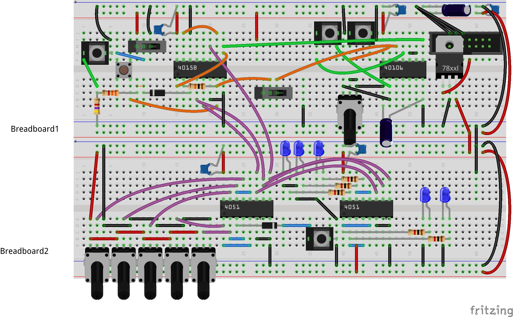
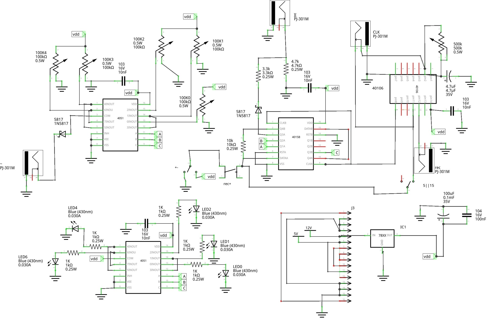
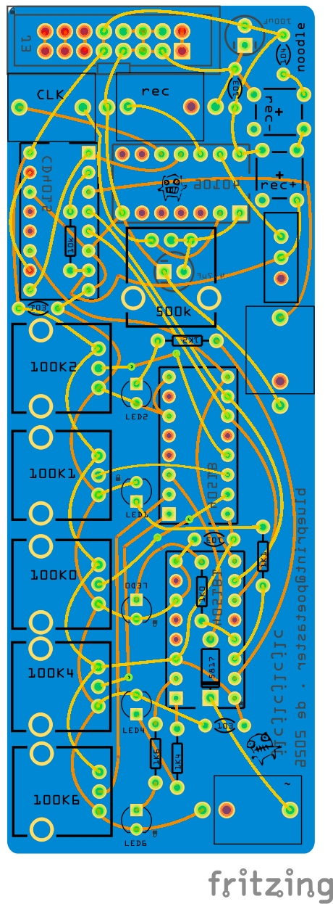

# noodle
Noodle is a wandering sequencer for eurorack implemented with CMOS.

Current gerbers are confirmed from production and work well.

## overview
Noodle uses a classic shift register (4015) combined with an analog mux (4051 x 2) to produces sequences. You can dial in up to 5 notes and 3 slots are reserved as 'rests'. The 'record' input (or button) with cause a toggle of the 'current' state of the slot in the 4015 which will make a select on the 4051. I noodles along.

This is NOT through to production yet. Just the breadboard view has been tested :)

